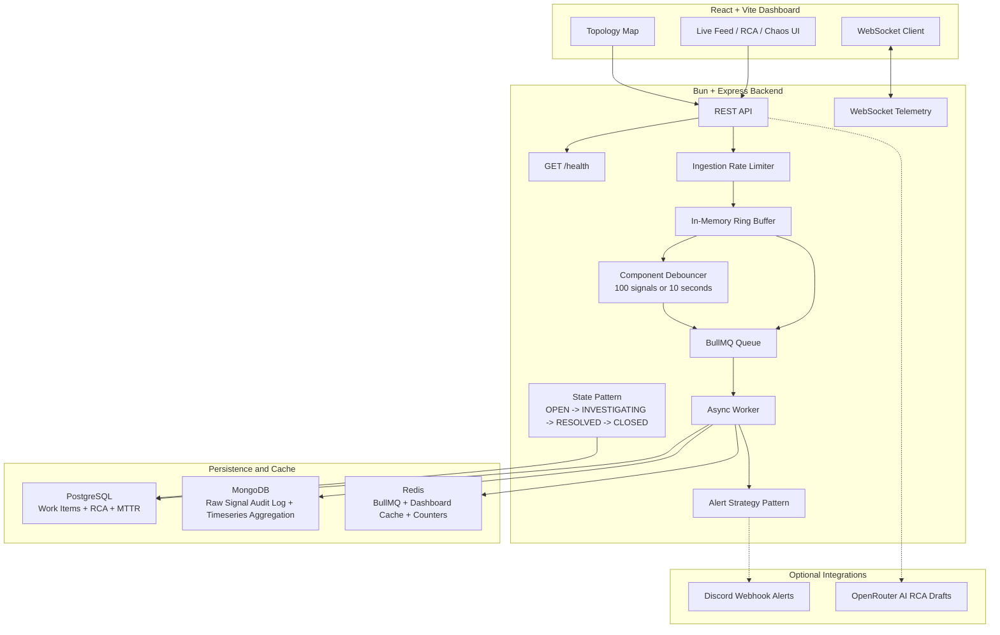

# Incident Management System (IMS)

A resilient Incident Management System for ingesting high-volume failure signals, debouncing noisy component failures, creating workflow-driven incidents, and closing incidents only after a complete Root Cause Analysis (RCA).

**Live Demo**: [ims.hitanshu.xyz](https://ims.hitanshu.xyz) — hosted on an AWS EC2 `t3.medium` instance (2 vCPU, 4 GB RAM)

This repository is structured as:

- `server/`: Bun + Express backend, BullMQ worker, PostgreSQL/MongoDB/Redis integrations
- `client/`: React + Vite dashboard
- `docker-compose.yml`: full local stack for Postgres, MongoDB, Redis, backend, and frontend

## Architecture



## Tech Stack Choices

| Layer | Choice | Why |
| --- | --- | --- |
| Runtime/API | Bun + Express | Fast TypeScript runtime with simple HTTP routing |
| Async jobs | BullMQ + Redis | Durable async processing, retry, backoff, and worker concurrency |
| Source of truth | PostgreSQL | Transactional work item and RCA records |
| Data lake | MongoDB | High-volume raw signal payload storage and aggregation pipeline support |
| Hot path/cache | Redis | Queue backend, dashboard cache, counters, and dropped-signal metrics |
| Frontend | React + Vite | Responsive dashboard with fast local development |
| Validation | Zod | Runtime validation for ingestion and RCA payloads |
| Tests | Bun test | Fast backend unit tests |

## Data Model and Storage Separation

| Purpose | Store | Implementation |
| --- | --- | --- |
| Raw signal audit log | MongoDB | `Signal` documents in `server/models/Signal.ts` |
| Work items | PostgreSQL | `work_items` table in `server/db/init.sql` |
| RCA records | PostgreSQL | `rca` table with generated `mttr_seconds` |
| Queue state | Redis | BullMQ queue in `server/queue/producer.ts` |
| Dashboard cache | Redis | `getDashboardState` / `setDashboardState` in `server/db/redis.ts` |
| Timeseries aggregation | MongoDB | `/api/dashboard/timeseries` aggregation pipeline |

PostgreSQL remains the source of truth for incident workflow state. MongoDB stores all raw error payloads for auditability and detail views.

## Backpressure and Scaling

The ingestion path is intentionally split so the API does not synchronously write every signal to every database:

1. `POST /api/signals` validates the payload and applies `express-rate-limit`.
2. Accepted signals enter a preallocated in-memory ring buffer.
3. If the ring buffer is full, the API returns `503 Service Unavailable` and increments a Redis dropped-signal metric.
4. A drain loop pulls up to 200 signals every 100ms and enqueues raw persistence jobs to BullMQ.
5. The debouncer groups signals by `component_id`; it flushes once the bucket reaches 100 signals or the 10-second timer expires.
6. The worker stores raw signals in MongoDB and creates or updates one PostgreSQL work item for the grouped component.

This design protects the API event loop and persistence layer during bursts. The default ring buffer capacity is `50,000`, the debounce threshold is `100`, and the debounce window is `10,000ms`; these are configurable through environment variables.

## Workflow and RCA Rules

Work items follow this lifecycle:

```text
OPEN -> INVESTIGATING -> RESOLVED -> CLOSED
```

Additional supported paths:

```text
INVESTIGATING -> OPEN
RESOLVED -> INVESTIGATING
```

Rules enforced by the backend:

- `OPEN -> CLOSED` and `OPEN -> RESOLVED` are rejected.
- RCA submission is accepted only when the work item is `RESOLVED`.
- Closing a work item is rejected if the RCA is missing or incomplete.
- RCA requires `incident_start`, `incident_end`, `root_cause_category`, `fix_applied`, and `prevention_steps`.
- `incident_end` must be after `incident_start`.
- MTTR is calculated by PostgreSQL as `incident_end - incident_start` in `rca.mttr_seconds`.

The State Pattern is implemented in `server/workflow/state.ts`. Alert routing uses the Strategy Pattern in `server/workflow/strategy.ts`.

## Dashboard Features

The React dashboard includes:

- Summary cards for incident counts and operational metrics
- Live feed sorted by priority or time
- Incident detail panel with current state
- Raw signal log view from MongoDB
- RCA form with category dropdown and text areas
- State transition actions for acknowledge, resolve, submit RCA, and close
- Topology map and chaos simulator views
- WebSocket updates for work item and throughput events
- Optional AI-assisted RCA draft generation when `OPENROUTER_API_KEY` is configured

## API Reference

| Method | Path | Purpose |
| --- | --- | --- |
| `GET` | `/health` | Health and basic runtime metrics |
| `POST` | `/api/signals` | Ingest one signal |
| `GET` | `/api/work-items` | List work items with pagination and optional filters |
| `GET` | `/api/work-items/:id` | Fetch one work item |
| `PATCH` | `/api/work-items/:id/transition` | Move a work item through the state machine |
| `GET` | `/api/work-items/:id/signals` | Fetch linked raw signals from MongoDB |
| `POST` | `/api/work-items/:id/rca` | Submit an RCA for a resolved work item |
| `GET` | `/api/work-items/:id/rca` | Fetch a submitted RCA |
| `POST` | `/api/work-items/:id/rca/draft` | Generate an optional AI RCA draft |
| `GET` | `/api/dashboard/summary` | Dashboard counts, MTTR, MTTA, and top components |
| `GET` | `/api/dashboard/timeseries` | MongoDB signal aggregation over time |
| `POST` | `/api/dashboard/ai-summary` | Optional AI dashboard summary |

Example signal payload:

```json
{
  "signal_id": "0de7a3c5-08a1-4de9-aadc-4b37e879d302",
  "component_id": "PG_PROD_01",
  "component_type": "RDBMS",
  "severity": "CRITICAL",
  "message": "Connection timeout error: pool exhausted",
  "timestamp": "2026-05-03T10:00:00.000Z",
  "payload": {
    "source": "chaos_simulator"
  }
}
```

## Setup

### Prerequisites

- Docker and Docker Compose
- Bun
- Node.js/npm for the frontend when running outside Docker

### Docker Compose

```bash
make up
make logs
```

Docker endpoints:

- Frontend: `http://localhost:5173`
- Backend API: `http://localhost:3001`
- Health check: `http://localhost:3001/health`

Stop containers without deleting volumes:

```bash
make down
```

Reset all databases:

```bash
make nuke
```

### Local Development

Start only the databases:

```bash
make infra
```

Install dependencies:

```bash
make install
```

Run backend and frontend locally:

```bash
make dev
```

Local endpoints:

- Frontend: `http://localhost:5173`
- Backend API: `http://localhost:5555`
- Health check: `http://localhost:5555/health`

### Optional Environment Variables

The backend validates configuration at startup in `server/config.ts`.

| Variable | Default | Purpose |
| --- | --- | --- |
| `PORT` | `5555` locally, `3001` in Docker Compose | Backend port |
| `DATABASE_URL` | Required | PostgreSQL connection string |
| `MONGODB_URL` | Required | MongoDB connection string |
| `REDIS_URL` | Required | Redis connection string |
| `RING_BUFFER_CAPACITY` | `50000` | In-memory signal buffer size |
| `DEBOUNCE_WINDOW_MS` | `10000` | Component debounce window |
| `DEBOUNCE_THRESHOLD` | `100` | Signals required for immediate debounce flush |
| `WORKER_CONCURRENCY` | `5` | BullMQ worker concurrency |
| `RATE_LIMIT_WINDOW_MS` | `60000` | Ingestion rate-limit window |
| `RATE_LIMIT_MAX` | `1000` | Max ingestion requests per window |
| `DISABLE_RATE_LIMIT` | `false` | Disable rate limiting (useful for hammer burst testing) |
| `OPENROUTER_API_KEY` | unset | Enables AI RCA draft and summary endpoints |
| `DISCORD_WEBHOOK_URL` | unset | Enables outbound P0/P1 alert delivery |

For local development, create `server/.env` if you want optional integrations:

```bash
OPENROUTER_API_KEY="your_openrouter_key"
DISCORD_WEBHOOK_URL="https://discord.com/api/webhooks/..."
```

## Sample Data and Chaos Simulation

The sample incident script is `server/scripts/simulate-incident.ts`. It sends a database outage, an API cascade, and a cache pressure event.

Run it against the local backend on port `5555`:

```bash
make simulate
```

Run it against the Docker backend on port `3001`:

```bash
make simulate-docker
```

Run it against any deployed backend, including an AWS URL:

```bash
API_URL=https://your-api.example.com/api/signals make simulate
```

`API_URL` can be either the API base URL or the full ingestion endpoint. These are equivalent:

```bash
API_URL=https://your-api.example.com make simulate
API_URL=https://your-api.example.com/api/signals make simulate
```

The script prints the target ingestion endpoint before sending events, reports accepted/rejected/failed counts, and exits non-zero if no signals are accepted.

### 🛑 Load Shedding & Throughput Proof

To satisfy the 10,000 signals/sec ingestion burst requirement, the system relies on an in-memory ring buffer. Rather than allowing infinite queue growth which leads to OOM crashes, the API sheds load gracefully.

Running a concurrent burst test of 60,000 signals demonstrates this exact behavior. The API successfully ingests to capacity and instantly applies pushback (HTTP 503) to protect the Node event loop, all while sustaining over **15,000 req/sec** throughput.

> **Note on Environment:** This test was run natively on Linux, where Docker binds directly to the kernel's network stack. Running this on macOS/Windows via Docker Desktop will artificially cap throughput at ~6,000 req/sec due to virtualized network bridge overhead.

```text
🔨 HAMMER TEST - Burst Verification
============================================================
Target URL: http://localhost:3001/api/signals
Burst Size: 60,000 requests
Concurrency: 10000
============================================================
⏳ Firing burst...

Progress: 100.0% (60000/60000)

📊 RESULTS
============================================================
Total Requests: 60,000
Successful (202): 56,886 (94.81%)
Backpressure (503): 3,114 (5.19%)
Rate Limited (429): 0 (0.00%)

Total Duration: 3797.09ms
Actual Rate: 15,802 req/sec

✅ VERIFICATION
============================================================
Burst Rate (≥10k/sec): ✅ PASS (15802 req/sec)
Backpressure Active (503s): ✅ PASS (3114 responses)

🎉 HAMMER TEST PASSED - System handles 10k/sec burst with backpressure
```

**Running the Hammer Test:**

```bash
# Start databases
make infra

# Start the backend locally with rate limiting disabled
DISABLE_RATE_LIMIT=true make dev-server

# In another terminal, run the hammer test
cd server && bun run hammer -- --burst-size 60000 --concurrent 10000
```

The hammer script (`server/scripts/hammer.ts`) is a dedicated tooling artifact that explicitly verifies the 10k/sec burst requirement by:
- Firing a controlled burst of requests at maximum concurrency
- Tracking success/failure rates and response times
- Verifying backpressure behavior (503 responses when buffer is full)
- Providing clear pass/fail metrics for reviewers

## Testing

Run all backend tests:

```bash
make test
```

Run one test file:

```bash
make test-file F=state
make test-file F=dbRetry
```

Current test coverage includes:

- Ring buffer enqueue, drain, and overflow behavior
- Debouncer threshold and timer flush behavior
- PostgreSQL retry helper behavior for transient and non-transient errors
- State Pattern transitions and mandatory RCA guard
- API workflow coverage for invalid transitions, RCA status guards, incomplete RCA rejection, valid RCA submission, MTTR response, and close flow
- RCA schema validation, required fields, valid categories, and date ordering

Latest local verification:

```text
60 pass
0 fail
Ran 60 tests across 6 files.
```

## Observability and Resilience

- `/health` returns status, uptime, total accepted signals, and current throughput window.
- Throughput is logged every 5 seconds as `Signals/sec: <rate> | Dropped: <count>`.
- Dropped signals are tracked in Redis when the ring buffer rejects load.
- BullMQ jobs retry with exponential backoff.
- PostgreSQL route queries retry known transient failures such as connection drops, deadlocks, and serialization failures.
- State transitions use conditional PostgreSQL updates and reject stale concurrent updates with `409 Conflict`.
- Graceful shutdown closes the worker and queue.

## DB Write Retry Strategy

| Layer | Scope | Mechanism | Config |
|-------|-------|-----------|--------|
| BullMQ | Worker jobs | Job-level exponential backoff | 3 attempts, 1s → 2s → 4s (`producer.ts`) |
| `query()` helper | REST API routes | Per-query transient error retry | 2 retries, 500ms → 1s (`db/postgres.ts`) |

Transient errors (PG codes `08006`, `40P01`, `57P01`, `40001`; Node codes `ECONNRESET`, `ECONNREFUSED`) trigger automatic retry. Non-transient errors (unique violations `23505`, schema mismatches `23502`) are wrapped in `UnrecoverableError` to skip retry entirely.

## Notable Engineering Challenges

**Concurrent state transition false success** — The state machine used a conditional `WHERE id = $2 AND state = $3` update but did not check `rowCount`. A stale concurrent request could report success even after another request had already transitioned the work item. Fixed by checking `rowCount`, rolling back on zero updated rows, and returning `409 Conflict`. Unit test covers this path.

**MongoDB bulk insert collisions** — When the debouncer flushed a batch to the BullMQ worker, duplicate `signal_id`s caused the entire `insertMany` to fail. Fixed by using `{ ordered: false }` and catching `MongoBulkWriteError`, allowing unique signals to persist while safely ignoring duplicates.

**AI RCA output shape mismatches** — The LLM occasionally returned `["Step 1", "Step 2"]` arrays for `prevention_steps` instead of a string, failing Zod validation. Fixed with a normalization layer in the frontend: `Array.isArray(val) ? val.join("\n") : val` before populating the form.

**State machine bypass via API** — An engineer could submit an RCA and force-close a work item while it was still `OPEN`, bypassing the investigation workflow. Fixed by adding explicit state guards: `POST /rca` rejects unless state is `RESOLVED`, and `PATCH /transition` physically blocks invalid edges.

**Ephemeral RCA draft data loss** — AI-generated drafts stored in React state were lost on navigation or refresh. Fixed with `localStorage` keyed by `incident.id`, auto-saving on change and purging only on successful backend submission.

**Docker volume persistence after rename** — Renaming the database in `docker-compose.yml` still threw `database "ims" does not exist` because the old volume persisted. Fixed with `docker-compose down -v` to purge stale volume state.

## Known Limitations

- The ring buffer is in-memory. Accepted signals that have not yet reached BullMQ can be lost if the process crashes.
- The CLI simulation script defaults to `http://localhost:5555`, but can target Docker or deployed environments through `make simulate-docker` or `API_URL=... make simulate`.
- Optional AI and Discord integrations require external credentials and are disabled by default.

## Makefile Reference

| Command | Description |
| --- | --- |
| `make up` | Build and start the full Docker stack |
| `make down` | Stop containers and preserve volumes |
| `make nuke` | Stop containers and delete volumes |
| `make logs` | Tail Docker logs |
| `make infra` | Start only Postgres, MongoDB, and Redis |
| `make install` | Install backend and frontend dependencies |
| `make dev-server` | Run the backend locally |
| `make dev-client` | Run the frontend locally |
| `make dev` | Run backend and frontend locally |
| `make test` | Run all backend unit tests |
| `make test-file F=<name>` | Run one backend test file |
| `make simulate` | Run the sample chaos simulation against local backend `5555` or custom `API_URL` |
| `make simulate-docker` | Run the sample chaos simulation against Docker backend `3001` |
| `make hammer` | Run the hammer burst test to verify 10k/sec requirement |
| `make clean` | Remove local dependencies and build artifacts |