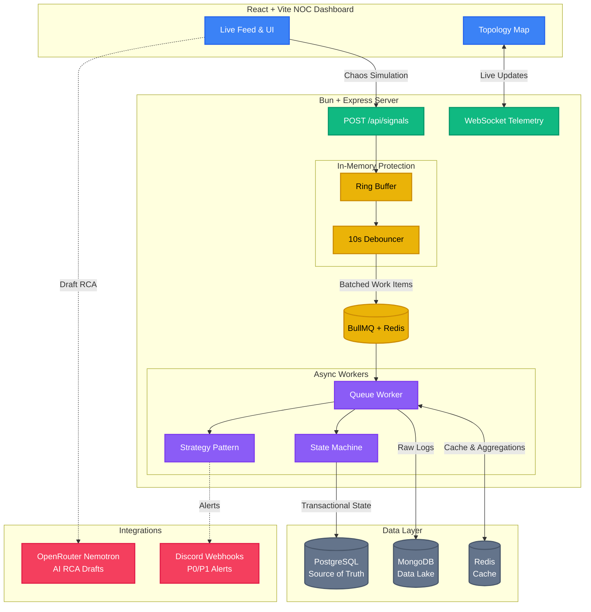

# Incident Management System (IMS)

An enterprise-grade, highly concurrent Incident Management System designed to ingest, debounce, and process high-volume failure signals from distributed systems. Features a robust backend built on Bun + Express, and a premium "NOC" (Network Operations Center) React + Vite dashboard.

## 🏗️ Architecture



## 🛡️ Backpressure & Resilience

The system is designed to handle **bursts of up to 10,000 signals/second** without crashing or overloading the database.

1. **The Ring Buffer (Immediate Absorption):** Incoming API requests hit a lightweight, pre-allocated in-memory Ring Buffer. If the buffer fills up, the API immediately responds with `503 Service Unavailable`, preventing the Node event loop from locking up.
2. **Dropped Signal Tracking:** When the Ring Buffer sheds load (503s), it increments a distributed Redis counter (`metrics:signals:dropped`). The throughput logger pulls this, allowing the system to self-report both its processing rate and its shed rate (`Signals/sec: 8200 | Dropped: 43`).
3. **The Debouncer (Sliding Window):** Signals are pulled from the buffer into a 10-second sliding window debouncer grouped by `component_id`. If a database drops and sends 100 identical failure signals in 3 seconds, the Debouncer intercepts them.
4. **Async Processing (BullMQ):** Instead of executing 100 database inserts on the main thread, the Debouncer emits **one** single WorkItem creation job to a Redis-backed BullMQ Queue. 
5. **Data Lake vs. Source of Truth:** The Async worker pulls the job, writes the 100 raw signals to the **MongoDB Data Lake**, but only executes **one** transactional state update in the **PostgreSQL Source of Truth**.

## 🚀 Docker Setup & Local Execution

### Prerequisites
- [Docker](https://www.docker.com/) & Docker Compose
- [Bun](https://bun.sh/) (JavaScript runtime)
- Node.js & npm (for Frontend)

### 1. Start the Databases
The required databases (PostgreSQL, MongoDB, and Redis) are containerized.
```bash
docker-compose up -d
```
*Wait a few seconds for PostgreSQL to fully initialize the schema from `server/db/init.sql`.*

### 2. Configure Environment Variables
In the `server/` directory, create a `.env` file based on the config schema:
```env
# Optional Addons
OPENROUTER_API_KEY="your_openrouter_key"
DISCORD_WEBHOOK_URL="your_discord_webhook"
```

### 3. Start the Backend Server
```bash
cd server
bun install
bun index.ts
```
The server will start on `http://localhost:5555` and output `Signals/sec: 0` every 5 seconds.

### 4. Start the Frontend NOC Dashboard
In a new terminal:
```bash
cd client
npm install
npm run dev
```
Open the provided Vite URL (usually `http://localhost:5173`).

### 5. Simulate Chaos!
To test the backpressure and observe the real-time topology map:
- Use the **Chaos Simulator** tab in the UI.
- Or run the dedicated CLI script:
```bash
cd server
bun run scripts/simulate-incident.ts
```

## 🧠 Design Patterns Utilized
- **Finite-State Machine (State Pattern):** Strictly controls incident transitions (`OPEN` → `INVESTIGATING` → `RESOLVED` → `CLOSED`). Prevents `CLOSED` transition if an RCA is missing.
- **Strategy Pattern:** Decouples alerting logic. `P0CriticalAlert` pings Discord, while `P3LowAlert` simply logs.

## 🔄 DB Write Retry & Resilience

The system uses a **dual-layer retry strategy** to survive transient PostgreSQL failures (connection drops, deadlocks, row locks):

| Layer | Scope | Mechanism | Config |
|-------|-------|-----------|--------|
| **Layer 1 — BullMQ** | Worker jobs (signal persistence, work item creation) | Job-level exponential backoff | 3 attempts, 1s → 2s → 4s (`producer.ts`) |
| **Layer 2 — `query()` helper** | REST API routes (CRUD, RCA submission, dashboard) | Per-query transient error retry | 2 retries, 500ms → 1s (`db/postgres.ts`) |

**Key behaviors:**
- **Transient errors** (PG codes `08006`, `40P01`, `57P01`, `40001`; Node codes `ECONNRESET`, `ECONNREFUSED`) trigger automatic retry with exponential backoff.
- **Non-transient errors** (unique violations `23505`, schema mismatches `23502`) are wrapped in BullMQ's `UnrecoverableError` to skip retry entirely.
- **Unit tests** in `tests/dbRetry.test.ts` mock `pool.query` to simulate connection failures and deadlocks, proving the retry mechanism triggers and recovers correctly.

## 🌟 Non-Functional Enhancements (Bonus Points)
To truly make this a senior-level, production-ready system, several non-functional enhancements were implemented:

1. **Pre-allocated Ring Buffer**: Absorbs initial API I/O spikes without reallocating memory, protecting the Node event loop.
2. **UUIDv7 Primary Keys**: Used across PostgreSQL for lexicographically sortable, time-based indexing, reducing B-Tree fragmentation for high-volume WorkItem inserts.
3. **Database Row-Level Locks**: The State Machine enforces `BEGIN/COMMIT` transactional boundaries when transitioning Work Item states to guarantee data integrity during concurrent queue processing.
4. **Discord Webhook Alerts**: The Strategy Pattern doesn't just log—it makes active outbound HTTP requests to push `P0`/`P1` alerts instantly to a live Discord channel.
5. **AI-Powered RCA Drafts**: Integrated the OpenRouter API (Nemotron 120B model) to actively parse raw MongoDB signal payloads and generate JSON-structured Root Cause Analysis drafts for the responding engineer.
6. **Distributed Shed-Load Tracking**: Integrated a Redis-backed dropped signal counter to explicitly track and log 503 rejections during extreme traffic spikes, proving the system's "self-awareness" of its own capacity constraints.

## 🐛 Bugs Encountered & Solved
During the development of this high-concurrency system, several interesting technical challenges emerged and were mitigated:

1. **MongoDB Bulk Insert Collisions (`MongoBulkWriteError`)**
   - *Issue*: When the Debouncer flushed a batch of 100 signals to the BullMQ worker, duplicate `signal_id`s caused the entire `insertMany` operation to fail, losing data.
   - *Solution*: Leveraged MongoDB's `{ ordered: false }` flag during bulk insertion and explicitly caught the `MongoBulkWriteError`. This allowed unique signals to persist while safely ignoring duplicates without crashing the worker queue.
2. **AI RCA Output Shape Mismatches (Zod 400 Errors)**
   - *Issue*: The OpenRouter Nemotron LLM occasionally hallucinated JSON structures, returning string arrays `["Step 1", "Step 2"]` for the `prevention_steps` field instead of a continuous string, which caused the strict Zod backend schema to throw a `400 Bad Request`.
   - *Solution*: Built a defensive normalization layer in the frontend that detects `Array.isArray()` and automatically joins the strings with newlines before populating the RCA form.
3. **State Machine Bypasses**
   - *Issue*: During testing, it was discovered that an engineer could use an API tool to submit an RCA and forcefully close a Work Item while it was still in the `OPEN` state, completely bypassing the investigation workflow.
   - *Solution*: Enforced strict API-level guards. The `POST /rca` route now explicitly rejects submissions unless the `WorkItem` is currently in the `RESOLVED` state. Similarly, the `PATCH /transition` route utilizes the State Pattern to physically block invalid edge traversals (e.g., `OPEN` → `CLOSED`).
4. **React/Vite ESM Type Resolution Errors**
   - *Issue*: The Vite frontend kept crashing with `Uncaught SyntaxError: The requested module does not provide an export named 'WorkItem'`.
   - *Solution*: Root-caused to Vite's strict ES Module handling of TypeScript interfaces during Fast Refresh. Resolved by enforcing explicit `import type { ... }` declarations across all React components.
