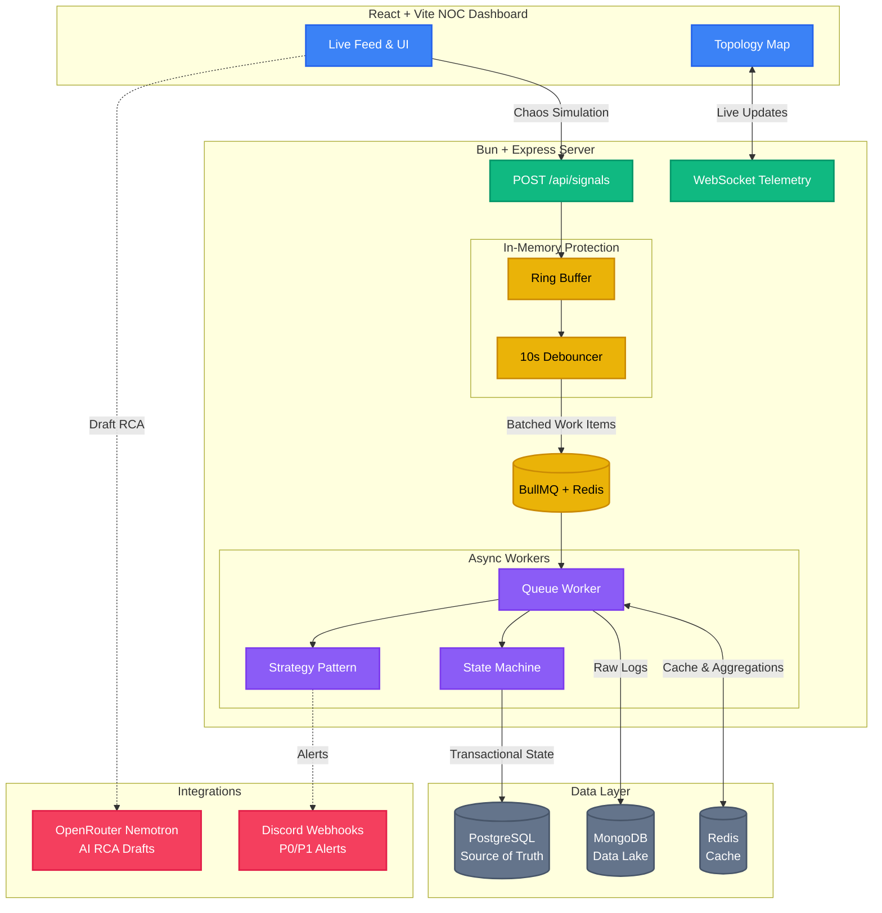

# Incident Management System (IMS)

An enterprise-grade, highly concurrent Incident Management System designed to ingest, debounce, and process high-volume failure signals from distributed systems. Features a robust backend built on Bun + Express, and a premium "NOC" (Network Operations Center) React + Vite dashboard.

## Architecture



## Backpressure & Resilience

The system is designed to handle **bursts of up to 10,000 signals/second** without crashing or overloading the database.

1. **The Ring Buffer (Immediate Absorption):** Incoming API requests hit a lightweight, pre-allocated in-memory Ring Buffer. If the buffer fills up, the API immediately responds with `503 Service Unavailable`, preventing the Node event loop from locking up.
2. **Dropped Signal Tracking:** When the Ring Buffer sheds load (503s), it increments a distributed Redis counter (`metrics:signals:dropped`). The throughput logger pulls this, allowing the system to self-report both its processing rate and its shed rate (`Signals/sec: 8200 | Dropped: 43`).
3. **The Debouncer (Sliding Window):** Signals are pulled from the buffer into a 10-second sliding window debouncer grouped by `component_id`. If a database drops and sends 100 identical failure signals in 3 seconds, the Debouncer intercepts them.
4. **Async Processing (BullMQ):** Instead of executing 100 database inserts on the main thread, the Debouncer emits **one** single WorkItem creation job to a Redis-backed BullMQ Queue. 
5. **Data Lake vs. Source of Truth:** The Async worker pulls the job, writes the 100 raw signals to the **MongoDB Data Lake**, but only executes **one** transactional state update in the **PostgreSQL Source of Truth**.

## Quick Start

### Prerequisites
- [Docker](https://www.docker.com/) & Docker Compose
- [Bun](https://bun.sh/) (JavaScript runtime)
- [npm](https://www.npmjs.com/) (for React + Vite Frontend)

### One-Command Launch (Docker)
```bash
make up        # builds & starts everything (Postgres, Mongo, Redis, Server, Client)
make logs      # tail all container logs
```
Open `http://localhost:5173` for the NOC Dashboard, and `http://localhost:3001` for the API.

### Manual Setup (Local Dev)
```bash
# 1. Start only the databases
make infra

# 2. Configure environment (optional addons)
cat > server/.env << 'EOF'
OPENROUTER_API_KEY="your_openrouter_key"
DISCORD_WEBHOOK_URL="your_discord_webhook"
EOF

# 3. Install dependencies & start both services
make install
make dev
```
The server starts on `http://localhost:5555` and outputs `Signals/sec: 0` every 5 seconds.

### Simulate Chaos!
```bash
make simulate                # CLI chaos script
```
Or use the **Chaos Simulator** tab directly in the UI.

### Makefile Reference

| Command | Description |
|---------|-------------|
| `make up` | Build & start all services in Docker |
| `make down` | Stop all containers (preserves data) |
| `make nuke` | Stop & destroy all volumes (fresh DB) |
| `make logs` | Tail all container logs |
| `make infra` | Start only Postgres, Mongo, Redis |
| `make install` | Install server & client dependencies |
| `make dev` | Run server + client locally |
| `make test` | Run all backend unit tests |
| `make test-file F=dbRetry` | Run a specific test file |
| `make simulate` | Fire the CLI chaos simulator |
| `make clean` | Remove node_modules & build artifacts |

## Design Patterns Utilized
- **Finite-State Machine (State Pattern):** Strictly controls incident transitions (`OPEN` → `INVESTIGATING` → `RESOLVED` → `CLOSED`). Prevents `CLOSED` transition if an RCA is missing.
- **Strategy Pattern:** Decouples alerting logic. `P0CriticalAlert` pings Discord, while `P3LowAlert` simply logs.

## DB Write Retry & Resilience

The system uses a **dual-layer retry strategy** to survive transient PostgreSQL failures (connection drops, deadlocks, row locks):

| Layer | Scope | Mechanism | Config |
|-------|-------|-----------|--------|
| **Layer 1 — BullMQ** | Worker jobs (signal persistence, work item creation) | Job-level exponential backoff | 3 attempts, 1s → 2s → 4s (`producer.ts`) |
| **Layer 2 — `query()` helper** | REST API routes (CRUD, RCA submission, dashboard) | Per-query transient error retry | 2 retries, 500ms → 1s (`db/postgres.ts`) |

**Key behaviors:**
- **Transient errors** (PG codes `08006`, `40P01`, `57P01`, `40001`; Node codes `ECONNRESET`, `ECONNREFUSED`) trigger automatic retry with exponential backoff.
- **Non-transient errors** (unique violations `23505`, schema mismatches `23502`) are wrapped in BullMQ's `UnrecoverableError` to skip retry entirely.
- **Unit tests** in `tests/dbRetry.test.ts` mock `pool.query` to simulate connection failures and deadlocks, proving the retry mechanism triggers and recovers correctly.

## Non-Functional Enhancements
To truly make this a senior-level, production-ready system, several non-functional enhancements were implemented:

1. **Pre-allocated Ring Buffer**: Absorbs initial API I/O spikes without reallocating memory, protecting the Node event loop.
2. **UUIDv7 Primary Keys**: Used across PostgreSQL for lexicographically sortable, time-based indexing, reducing B-Tree fragmentation for high-volume WorkItem inserts.
3. **Database Row-Level Locks**: The State Machine enforces `BEGIN/COMMIT` transactional boundaries when transitioning Work Item states to guarantee data integrity during concurrent queue processing.
4. **Discord Webhook Alerts**: The Strategy Pattern doesn't just log—it makes active outbound HTTP requests to push `P0`/`P1` alerts instantly to a live Discord channel.
5. **AI-Powered RCA Drafts**: Integrated the OpenRouter API (Nemotron 120B model) to actively parse raw MongoDB signal payloads and generate JSON-structured Root Cause Analysis drafts for the responding engineer.
6. **Distributed Shed-Load Tracking**: Integrated a Redis-backed dropped signal counter to explicitly track and log 503 rejections during extreme traffic spikes, proving the system's "self-awareness" of its own capacity constraints.

## Bugs *I* Encountered & Solved
During the development of this high-concurrency system, several interesting technical challenges emerged and were mitigated:

1. **MongoDB Bulk Insert Collisions (`MongoBulkWriteError`)**
   - *Issue*: When the Debouncer flushed a batch of 100 signals to the BullMQ worker, duplicate `signal_id`s caused the entire `insertMany` operation to fail, losing data.
   - *Solution*: Leveraged MongoDB's `{ ordered: false }` flag during bulk insertion and explicitly caught the `MongoBulkWriteError`. This allowed unique signals to persist while safely ignoring duplicates without crashing the worker queue.
2. **AI RCA Output Shape Mismatches (Zod 400 Errors)**
   - *Issue*: The OpenRouter Nemotron LLM occasionally hallucinated JSON structures, returning string arrays `["Step 1", "Step 2"]` for the `prevention_steps` field instead of a continuous string, which caused the strict Zod backend schema to throw a `400 Bad Request`.
   - *Solution*: Built a defensive normalization layer in the frontend that detects `Array.isArray()` and automatically joins the strings with newlines before populating the RCA form.
3. **State Machine Bypasses**
   - *Issue*: During testing, it was discovered that an engineer could use an API tool to submit an RCA and forcefully close a Work Item while it was still in the `OPEN` state, completely bypassing the investigation workflow.
   - *Solution*: Enforced strict API-level guards. The `POST /rca` route now explicitly rejects submissions unless the `WorkItem` is currently in the `RESOLVED` state. Similarly, the `PATCH /transition` route utilizes the State Pattern to physically block invalid edge traversals (e.g., `OPEN` → `CLOSED`).
4. **React/Vite ESM Type Resolution Errors**
   - *Issue*: The Vite frontend kept crashing with `Uncaught SyntaxError: The requested module does not provide an export named 'WorkItem'`.
   - *Solution*: Root-caused to Vite's strict ES Module handling of TypeScript interfaces during Fast Refresh. Resolved by enforcing explicit `import type { ... }` declarations across all React components.
5. **PostgreSQL Volume Persistence (The "Stale Database" Bug)**
   - *Issue*: After renaming the production database in `docker-compose.yml`, the system still threw `database "ims" does not exist` errors.
   - *Solution*: Identified that Docker volumes are persistent across restarts. Performed a `docker-compose down -v` to purge the old volume and allow the fresh `ims_db` to initialize.
6. **Frontend-Backend Docker Port Mismatch**
   - *Issue*: API calls and the Chaos Simulator failed in Docker but worked locally.
   - *Cause*: Hardcoded `localhost:5555` URLs in React components didn't match the Docker-mapped port `3001`.
   - *Solution*: Centralized API logic into a `config.ts` that dynamically selects the base URL from environment variables, ensuring environment-agnostic networking.
7. **PostgreSQL Healthcheck Fatal Logs**
   - *Issue*: Container logs were being spammed with `FATAL: database "ims" does not exist` every 5 seconds.
   - *Cause*: The Docker `healthcheck` used `pg_isready -U ims`, which defaulted to checking a database matching the username.
   - *Solution*: Explicitly scoped the healthcheck to the correct database using the `-d` flag: `pg_isready -U ims -d ims_db`.
8. **React State Bleeding Across Components**
   - *Issue*: When switching between active incidents in the frontend, the `IncidentDetail` component retained transient state (like "Generating Draft" loading indicators), causing UI inconsistencies.
   - *Solution*: Forced a complete component remount by explicitly passing `key={selectedItem.id}` to the detail component, guaranteeing a clean state initialization upon navigation.
9. **Ephemeral RCA Draft Data Loss**
   - *Issue*: AI-generated RCA drafts were stored purely in React state, meaning the drafted text was permanently lost if the user navigated to another incident or refreshed the page before submitting.
   - *Solution*: Implemented a robust caching mechanism leveraging `localStorage` keyed by `incident.id`. The frontend automatically saves and restores drafts across sessions, and purges the local cache only upon a successful backend submission.
10. **Closed Incidents Displaying Blank RCA Forms**
    - *Issue*: Viewing an already `CLOSED` incident in the dashboard displayed a blank RCA form rather than the finalized report, confusing users into thinking data was lost.
    - *Solution*: Added an explicit data-fetching effect that queries `GET /api/work-items/:id/rca` for closed incidents and populates the disabled form with the permanent database record.
11. **UTC Timestamp Discrepancies in Live Logs**
    - *Issue*: The Live Logs tab rendered timestamps using raw `.toISOString()`, forcing Zulu (UTC) time. This caused confusion for engineers as the timestamps did not align with their local system clocks.
    - *Solution*: Replaced the raw UTC strings with an offset-adjusted localization technique, rendering exact local time with millisecond precision for rapid, localized diagnostics.
12. **Native Dropdown Legibility in Dark Theme**
    - *Issue*: Select dropdowns (like the RCA Category and the Feed Sorting menu) rendered with the operating system's default white background, making the text illegible against the dark dashboard theme.
    - *Solution*: Unified the dropdowns under the global `.form-control` class and explicitly enforced dark background tokens on the `<option>` child elements to override the native OS styling.
