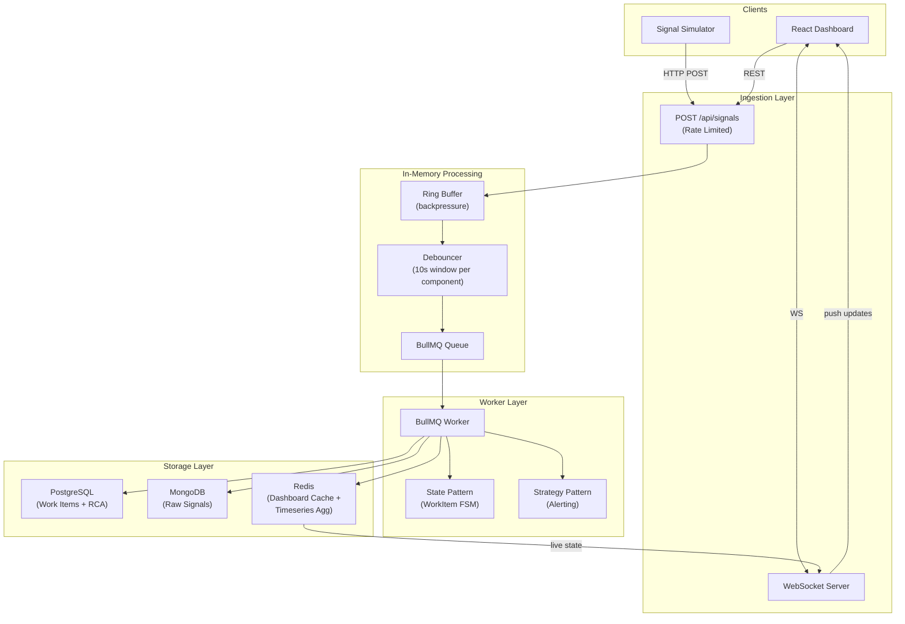

# Mission-Critical Incident Management System (IMS) — Implementation Plan

## Background & Current State

You've already bootstrapped a solid foundation:
- **Runtime**: Bun + Express (TypeScript)
- **Databases**: PostgreSQL 18 (work_items + rca tables), MongoDB 7 (signal store), Redis 7 (cache + BullMQ)
- **Queue**: BullMQ for async processing
- **Docker Compose**: All infra services defined with healthchecks
- **Schema**: Strong `init.sql` with ENUMs, computed MTTR column, indexes

The `index.ts` entry point references `connectPostgres`, `connectMongo`, `setupWebSocket`, `startWorker`, and `startThroughputLogger` — all still unimplemented. This plan fills in every gap.

---

## Proposed Architecture



---

## Tech Stack Justification

| Layer | Technology | Why |
|-------|-----------|-----|
| Runtime | **Bun** | Fastest JS runtime; native TS support; built-in test runner |
| HTTP | **Express 5** | Mature, middleware ecosystem; v5 has native async handler support |
| Queue | **BullMQ** | Redis-backed, retries, concurrency control, rate limiting built-in |
| RDBMS | **PostgreSQL 18** | Transactional integrity for work items + RCA; computed columns for MTTR |
| NoSQL | **MongoDB 7** | Flexible schema for raw signal payloads; great for audit log queries |
| Cache | **Redis 7** | In-memory hot-path for dashboard state; BullMQ transport; timeseries support |
| Realtime | **WebSocket (ws)** | Push live dashboard updates; avoids polling |
| Validation | **Zod 4** | Runtime schema validation with TypeScript inference |
| Frontend | **React + Vite** | Fast dev experience, component-driven, wide ecosystem |
| Containerization | **Docker Compose** | Single `docker compose up` for entire stack |

---

## Proposed Changes

### Component 1: Backend Core Structure

Create a clean, layered directory structure inside `/server`:

```
server/
├── index.ts                  # Entry point (bootstrap)
├── config.ts                 # [NEW] Environment config with Zod validation
├── db/
│   ├── init.sql              # Existing schema
│   ├── postgres.ts           # Existing (will enhance with retry)
│   ├── mongo.ts              # [NEW] Mongoose connection
│   └── redis.ts              # [NEW] ioredis connection + cache helpers
├── ingestion/
│   ├── router.ts             # [NEW] POST /api/signals route
│   ├── ringBuffer.ts         # [NEW] Bounded in-memory buffer for backpressure
│   ├── debouncer.ts          # [NEW] 10s sliding-window dedup per component_id
│   └── schema.ts             # [NEW] Zod schema for signal payloads
├── queue/
│   ├── producer.ts           # [NEW] BullMQ queue producer
│   └── worker.ts             # [NEW] BullMQ worker (consumes & persists)
├── workflow/
│   ├── state.ts              # [NEW] State Pattern — WorkItem FSM
│   ├── strategy.ts           # [NEW] Strategy Pattern — Alerting
│   └── types.ts              # [NEW] Shared workflow types
├── routes/
│   ├── workItems.ts          # [NEW] CRUD + state transitions for work items
│   ├── rca.ts                # [NEW] RCA submission with validation
│   └── dashboard.ts          # [NEW] Dashboard aggregate endpoints
├── models/
│   ├── Signal.ts             # [NEW] Mongoose model for raw signals
│   └── types.ts              # [NEW] Shared TypeScript types/interfaces
├── websocket/
│   └── server.ts             # [NEW] WebSocket server for live push
├── observability/
│   └── metrics.ts            # [NEW] Throughput logger (signals/sec every 5s)
├── middleware/
│   └── rateLimiter.ts        # [NEW] express-rate-limit configuration
└── tests/
    ├── debouncer.test.ts     # [NEW] Unit tests for debounce logic
    ├── state.test.ts         # [NEW] Unit tests for state transitions
    ├── rca.test.ts           # [NEW] Unit tests for RCA validation
    └── ringBuffer.test.ts    # [NEW] Unit tests for ring buffer
```

---

### Component 2: Signal Ingestion & Backpressure

#### [NEW] `server/ingestion/schema.ts`
- Zod schema for incoming signals:
  ```ts
  { signal_id, component_id, component_type, severity, message, payload, timestamp }
  ```
- `component_type` enum: `API | MCP_HOST | CACHE | QUEUE | RDBMS | NOSQL`

#### [NEW] `server/ingestion/ringBuffer.ts`
- Fixed-capacity circular buffer (configurable, default 50,000 slots)
- `enqueue()` returns `false` when full → HTTP 503 "backpressure" response
- Non-blocking; no persistence dependency
- Drains into BullMQ in batches (configurable batch size, e.g., 100)

#### [NEW] `server/ingestion/debouncer.ts`
- In-memory `Map<component_id, { signals: Signal[], timer: Timer, count: number }>`
- On signal arrival: increment count for component_id
- If count reaches 100 OR 10-second window expires → emit ONE work item creation job to BullMQ, attach all accumulated signal IDs
- Uses `setTimeout` for the window; `clearTimeout` on threshold trigger

#### [NEW] `server/ingestion/router.ts`
- `POST /api/signals` — validate with Zod, push to ring buffer
- Rate limited via `express-rate-limit` middleware
- Returns `202 Accepted` (async processing)

---

### Component 3: Async Queue Processing

#### [NEW] `server/queue/producer.ts`
- BullMQ `Queue` instance connected to Redis
- `enqueueSignalBatch(signals[])` — called by ring buffer drain loop
- `enqueueWorkItemCreation(component_id, signalIds[])` — called by debouncer

#### [NEW] `server/queue/worker.ts`
- BullMQ `Worker` with configurable concurrency (default 5)
- Job types:
  1. **`process-signals`**: Bulk-insert raw signals into MongoDB; update debouncer
  2. **`create-work-item`**: Insert work item into Postgres (transactional); link signals in MongoDB; publish to WebSocket; update Redis cache
- Retry logic: 3 attempts with exponential backoff for DB writes
- On failure: dead-letter queue for manual inspection

---

### Component 4: Design Patterns (Workflow Engine)

#### [NEW] `server/workflow/state.ts` — State Pattern
```ts
interface WorkItemState {
  name: string;
  canTransitionTo(next: string): boolean;
  onEnter(workItem): Promise<void>;
  onExit(workItem): Promise<void>;
}
```
- Concrete states: `OpenState`, `InvestigatingState`, `ResolvedState`, `ClosedState`
- `ClosedState.onEnter()` — rejects if RCA is missing/incomplete
- `WorkItemContext` — holds current state, delegates `transition()` calls
- Valid transitions:
  ```
  OPEN → INVESTIGATING
  INVESTIGATING → RESOLVED
  INVESTIGATING → OPEN  (re-open)
  RESOLVED → CLOSED
  RESOLVED → INVESTIGATING  (re-investigate)
  ```

#### [NEW] `server/workflow/strategy.ts` — Strategy Pattern
```ts
interface AlertStrategy {
  alert(workItem: WorkItem): Promise<void>;
}
```
- `P0CriticalAlert` — console.error + immediate escalation log (RDBMS, MCP_HOST)
- `P1HighAlert` — console.warn + escalation after 5 min (QUEUE, API)
- `P2MediumAlert` — console.info (CACHE)
- `P3LowAlert` — silent log (NOSQL)
- `AlertRouter` — maps `component_type` → strategy at runtime

Priority mapping:
| Component Type | Priority | Alert Strategy |
|---------------|----------|---------------|
| RDBMS | P0 | P0CriticalAlert |
| MCP_HOST | P0 | P0CriticalAlert |
| API | P1 | P1HighAlert |
| QUEUE | P1 | P1HighAlert |
| CACHE | P2 | P2MediumAlert |
| NOSQL | P3 | P3LowAlert |

---

### Component 5: REST API Routes

#### [NEW] `server/routes/workItems.ts`
| Method | Endpoint | Description |
|--------|----------|-------------|
| GET | `/api/work-items` | List all work items (filterable by state, priority, component_id); sorted by priority then created_at |
| GET | `/api/work-items/:id` | Single work item with linked signal count |
| PATCH | `/api/work-items/:id/transition` | Transition state (uses State Pattern) |
| GET | `/api/work-items/:id/signals` | Fetch linked raw signals from MongoDB |

#### [NEW] `server/routes/rca.ts`
| Method | Endpoint | Description |
|--------|----------|-------------|
| POST | `/api/work-items/:id/rca` | Submit RCA (validates completeness with Zod); computes MTTR |
| GET | `/api/work-items/:id/rca` | Retrieve RCA for a work item |

- RCA validation: all fields required (`incident_start`, `incident_end`, `root_cause_category`, `fix_applied`, `prevention_steps`); `incident_end > incident_start`

#### [NEW] `server/routes/dashboard.ts`
| Method | Endpoint | Description |
|--------|----------|-------------|
| GET | `/api/dashboard/summary` | Counts by state, priority; avg MTTR (served from Redis cache) |
| GET | `/api/dashboard/timeseries` | Signals over time (aggregated from MongoDB) |

---

### Component 6: Data Layer

#### [MODIFY] `server/db/postgres.ts`
- Add retry logic on initial connection (3 retries, exponential backoff)
- Add `query()` wrapper with automatic retry on transient errors

#### [NEW] `server/db/mongo.ts`
- Mongoose connection with retry logic
- Connection event logging

#### [NEW] `server/db/redis.ts`
- ioredis client (also used by BullMQ)
- Cache helper functions:
  - `setDashboardState(state)` / `getDashboardState()`
  - `setWorkItemCache(id, data)` / `getWorkItemCache(id)`
  - `incrementSignalCount(component_id)`

#### [NEW] `server/models/Signal.ts`
- Mongoose schema:
  ```ts
  { signal_id, component_id, component_type, severity, message,
    payload (Mixed), work_item_id (nullable), timestamp, ingested_at }
  ```
- Indexes on `component_id`, `work_item_id`, `timestamp`

---

### Component 7: WebSocket & Observability

#### [NEW] `server/websocket/server.ts`
- `ws` WebSocket server attached to the Express HTTP server
- Broadcasts on events: `work-item:created`, `work-item:updated`, `signal:burst`
- Heartbeat/ping-pong every 30s to detect stale connections

#### [NEW] `server/observability/metrics.ts`
- Atomic counter for signals ingested
- `setInterval` every 5 seconds → log `Throughput: X signals/sec` to console
- Exposed via `/health` endpoint (already exists, will enhance):
  ```json
  { "status": "ok", "uptime_s": 120, "signals_total": 5000,
    "throughput_per_sec": 42, "connections": { "postgres": true, "mongo": true, "redis": true } }
  ```

#### [NEW] `server/middleware/rateLimiter.ts`
- `express-rate-limit`: 1000 requests per minute per IP on `/api/signals`
- Returns `429 Too Many Requests` with `Retry-After` header

---

### Component 8: Frontend (React + Vite)

Create `/frontend` directory with a React + Vite project:

```
frontend/
├── index.html
├── package.json
├── vite.config.ts
├── Dockerfile
├── src/
│   ├── main.tsx
│   ├── App.tsx
│   ├── api/
│   │   └── client.ts           # Fetch wrapper for backend API
│   ├── hooks/
│   │   ├── useWebSocket.ts     # WebSocket hook for live updates
│   │   └── useWorkItems.ts     # Data fetching hook
│   ├── components/
│   │   ├── Layout.tsx          # App shell with sidebar nav
│   │   ├── LiveFeed.tsx        # Active incidents sorted by severity
│   │   ├── IncidentCard.tsx    # Single incident summary card
│   │   ├── IncidentDetail.tsx  # Full incident view with signals
│   │   ├── SignalTable.tsx     # Raw signals from MongoDB
│   │   ├── RCAForm.tsx         # RCA submission form
│   │   ├── DashboardStats.tsx  # Summary stats (counts, MTTR)
│   │   ├── StatusBadge.tsx     # State badge with color coding
│   │   └── PriorityBadge.tsx   # Priority badge (P0=red, P1=orange, etc.)
│   └── styles/
│       └── index.css           # Global styles (dark mode, glassmorphism)
```

**Key UI Features:**
1. **Live Feed** — Auto-updating list of active incidents, sorted by severity (P0 first), with real-time WebSocket updates
2. **Incident Detail** — Click to expand; shows raw signals table, status timeline, transition buttons
3. **RCA Form** — Date-time pickers, dropdown for root cause category, textareas for fix & prevention; form validates before submit
4. **Dashboard Header** — Cards showing: Open/Investigating/Resolved/Closed counts, avg MTTR, signals/min

**Design System:**
- Dark mode with glassmorphism cards
- Priority color coding: P0=`#ef4444`, P1=`#f97316`, P2=`#eab308`, P3=`#22c55e`
- State color coding: OPEN=red, INVESTIGATING=amber, RESOLVED=blue, CLOSED=green
- Smooth transitions on state changes
- Inter font family via Google Fonts

---

### Component 9: Testing

#### [NEW] `server/tests/debouncer.test.ts`
- Verify: 100 signals for same component_id within 10s → 1 work item
- Verify: signals for different component_ids → separate work items
- Verify: window reset after emission

#### [NEW] `server/tests/state.test.ts`
- Verify: valid transitions succeed (OPEN → INVESTIGATING → RESOLVED → CLOSED)
- Verify: invalid transitions throw (OPEN → CLOSED, OPEN → RESOLVED)
- Verify: CLOSED rejects without RCA

#### [NEW] `server/tests/rca.test.ts`
- Verify: incomplete RCA is rejected (missing fields)
- Verify: `incident_end < incident_start` is rejected
- Verify: valid RCA computes correct MTTR

#### [NEW] `server/tests/ringBuffer.test.ts`
- Verify: buffer overflow returns false
- Verify: drain produces correct batches

---

### Component 10: Sample Data & Documentation

#### [NEW] `scripts/simulate.ts`
- Bun script that fires 10,000 signals in bursts simulating:
  1. RDBMS outage (500 signals for `RDBMS_PRIMARY_01` in 5 seconds)
  2. Cache cascade (200 signals each for `CACHE_CLUSTER_01`, `CACHE_CLUSTER_02`)
  3. MCP host failure following RDBMS (300 signals for `MCP_HOST_01`)
- Configurable via CLI args: `bun scripts/simulate.ts --rate=1000 --duration=10`

#### [MODIFY] `README.md` (root level)
- Architecture diagram (Mermaid)
- Setup instructions with Docker Compose
- Backpressure handling explanation
- API reference
- Tech stack justification

---

## Open Questions

> [!IMPORTANT]
> **Frontend framework**: I've proposed React + Vite. The assignment allows React, Vue, or HTMX. Do you have a preference?

> [!IMPORTANT]
> **Repository structure**: The assignment says `/backend` and `/frontend` directories. Your current code is in `/server`. Should I rename `server/` → `backend/` to match, or keep `server/`?

> [!IMPORTANT]
> **Docker Compose location**: Currently `docker-compose.yml` is inside `/server`. The assignment expects it at the repository root. Should I move it up to `/zeotap/docker-compose.yml`?

> [!IMPORTANT]
> **Timeseries aggregations**: The assignment mentions "Support timeseries aggregations". Options:
> 1. **Redis TimeSeries module** (requires `redis/redis-stack` image instead of `redis:7-alpine`)
> 2. **MongoDB aggregation pipeline** on the signals collection (simpler, no new dependency)
> 3. Both
>
> I recommend option 2 (MongoDB aggregation) for simplicity since we're already storing signals there. We can add a `GET /api/dashboard/timeseries?interval=5m&range=1h` endpoint. Thoughts?

---

## Execution Order

| Phase | Components | Est. Time |
|-------|-----------|-----------|
| **1. Core Infra** | Config, DB connections (Postgres retry, Mongo, Redis), models | ~30 min |
| **2. Ingestion Pipeline** | Ring buffer, debouncer, signal schema, ingestion router, rate limiter | ~45 min |
| **3. Queue & Worker** | BullMQ producer, worker with retry logic | ~30 min |
| **4. Workflow Engine** | State pattern, strategy pattern, alerting | ~30 min |
| **5. REST API** | Work items CRUD, RCA endpoint, dashboard endpoint | ~30 min |
| **6. WebSocket & Observability** | WS server, metrics logger, enhanced /health | ~20 min |
| **7. Frontend** | React + Vite project, all components, styling | ~60 min |
| **8. Testing** | Unit tests for debouncer, state, RCA, ring buffer | ~20 min |
| **9. Sample Data & Docs** | Simulator script, README, architecture docs | ~15 min |

---

## Verification Plan

### Automated Tests
```bash
# Run all unit tests
cd server && bun test

# Expected: all pass for debouncer, state machine, RCA validation, ring buffer
```

### Integration Verification
```bash
# Start the entire stack
docker compose up --build

# Run the signal simulator
bun scripts/simulate.ts --rate=1000 --duration=10

# Verify in logs:
# - "Throughput: ~X signals/sec" printed every 5 seconds
# - Debounce merging visible (100 signals → 1 work item)
# - No crashes under load
```

### Manual / Browser Verification
- Open the React dashboard at `http://localhost:5173`
- Verify live feed updates in real-time during simulation
- Click an incident → verify signals table populated from MongoDB
- Submit RCA form → verify state transitions to CLOSED
- Attempt CLOSE without RCA → verify rejection
- Hit `/health` endpoint → verify all connections shown as healthy
